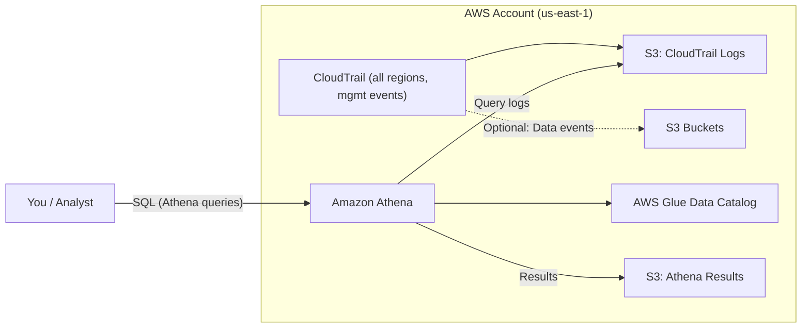
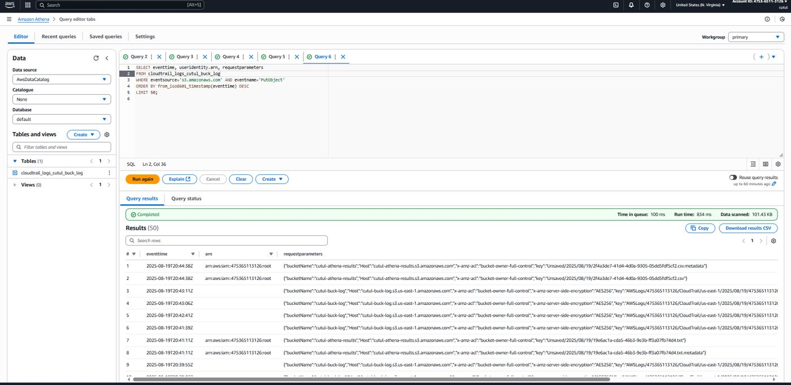
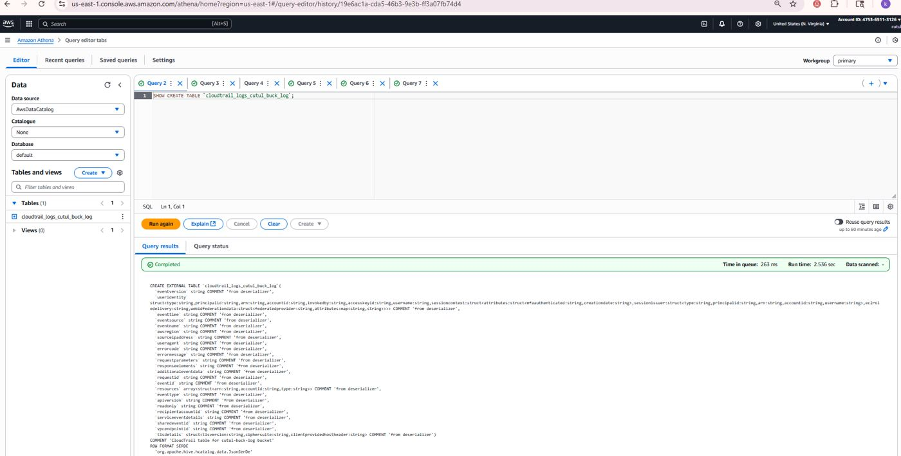
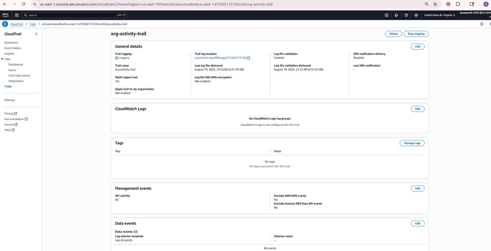
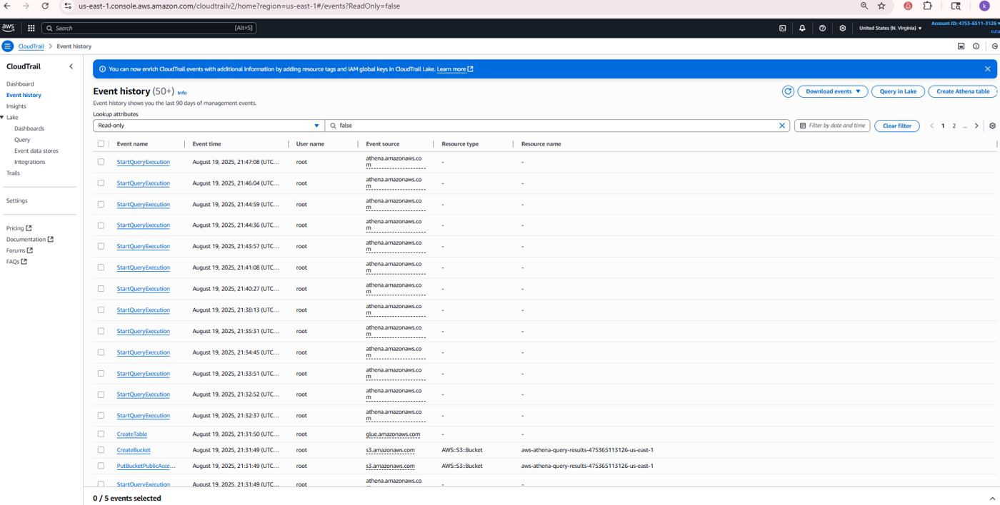
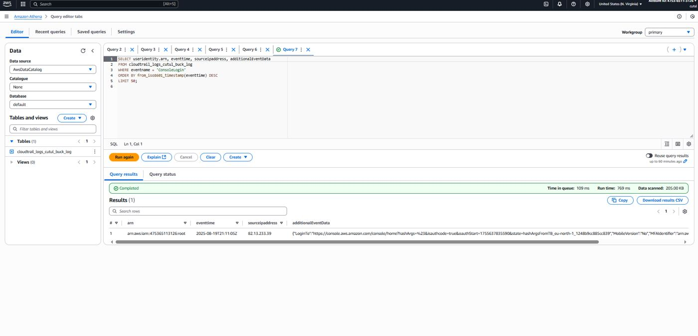
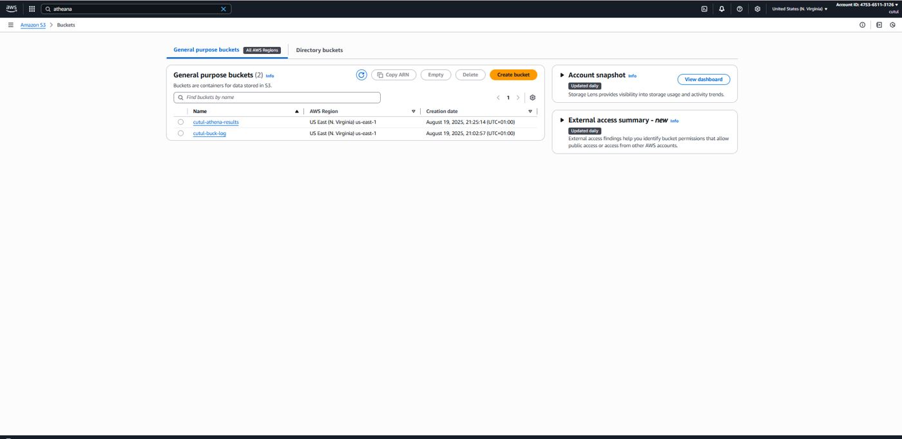
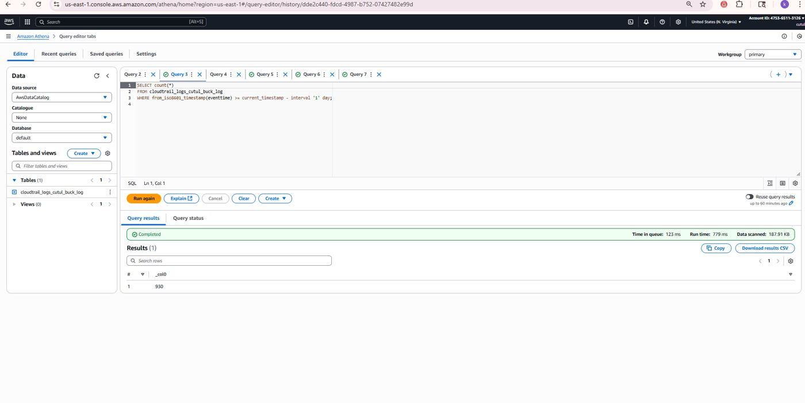
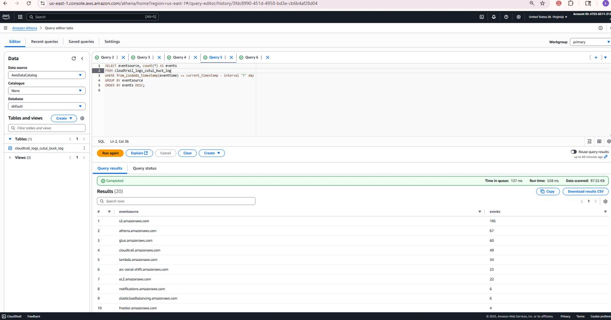

# TUK Project — AWS CloudTrail + S3 + Athena (us-east-1)


## 📌 Project Overview
This project (TUK) captures AWS account activity using **CloudTrail**, stores logs in **Amazon S3**, and queries them via **Amazon Athena**. The goal is a simple, reliable **audit & monitoring** pipeline you can run in minutes.

---

## 🛠️ Architecture



**Workflow:**
1. CloudTrail records AWS API activity.
2. Logs are delivered to an encrypted S3 bucket.
3. Athena queries the logs through a Glue table.
4. Results are stored in an Athena query results bucket.

---

## 📸 Screenshots










---

## 🚀 Steps Performed

### 1) S3 Buckets
- Create **S3 log bucket** for CloudTrail (block public access, enable SSE).
- Create **Athena results** bucket.

### 2) CloudTrail
- Trail applies to **all regions**, **management events: Read/Write**, **log file validation: on**.
- Destination: the S3 log bucket from step 1.

### 3) Athena + Glue
- Set query result location to the results bucket.
- From **CloudTrail → Event history → “Create Athena table”**, create a Glue table for your logs.
- (Optional) Use partition projection by `region/year/month/day` for low-cost queries.

### 4) Generate Activity
- Log in/out of console, list S3 buckets, open EC2/IAM pages (Describe/List calls are free).

---

## 🔎 Queries Run (examples)

> **Note:** Replace `<your_table_name>` with your actual Glue/Athena table name (e.g., `cloudtrail_logs` or `cloudtrail_logs_cutul_buck_log`). If you enabled partition projection, filter by partitions for cheaper scans.

**Today’s events in us-east-1**
```sql
SELECT count(*)
FROM <your_table_name>
WHERE region='us-east-1'
  AND year = date_format(current_date, '%Y')
  AND month = date_format(current_date, '%m')
  AND day = date_format(current_date, '%d');
```

**Recent console logins (today)**
```sql
SELECT eventtime, useridentity.arn, sourceipaddress
FROM <your_table_name>
WHERE region='us-east-1'
  AND year = date_format(current_date, '%Y')
  AND month = date_format(current_date, '%m')
  AND day = date_format(current_date, '%d')
  AND eventname='ConsoleLogin'
ORDER BY from_iso8601_timestamp(eventtime) DESC
LIMIT 50;
```

**S3 PutObject events (if S3 data events enabled)**
```sql
SELECT eventtime, useridentity.arn, requestparameters
FROM <your_table_name>
WHERE region='us-east-1'
  AND year = date_format(current_date, '%Y')
  AND month = date_format(current_date, '%m')
  AND day = date_format(current_date, '%d')
  AND eventsource='s3.amazonaws.com' AND eventname='PutObject'
ORDER BY from_iso8601_timestamp(eventtime) DESC
LIMIT 50;
```

**Top services used (last 7 days) — non-partitioned table**
```sql
SELECT eventsource, count(*) AS events
FROM <your_table_name>
WHERE from_iso8601_timestamp(eventtime) >= current_timestamp - interval '7' day
GROUP BY eventsource
ORDER BY events DESC;
```

---

## 💰 Cost & Security Notes
- **Management events** in CloudTrail are free to deliver to S3; **data events** incur charges—enable selectively.
- **Athena** charges per data scanned—use partition filters where possible.
- Keep log bucket **private** with **encryption** and optional **lifecycle** to Glacier.

---

## 🧹 Cleanup
1. Disable/delete the CloudTrail trail (if lab only).
2. Empty & delete the Athena results bucket.
3. Drop the Glue table/database.
4. Empty & delete the log bucket (if no longer needed).

---

## ✅ What's next
- Enable S3 **data events** for a target bucket and analyze `PutObject` activity.
- Create **Athena views** (`latest_console_logins`, `top_services_7d`) for quick analysis.
- Add an **S3 lifecycle policy** JSON example to transition old logs to Glacier.

---

## 🔗 References
- AWS CloudTrail: https://docs.aws.amazon.com/awscloudtrail/latest/userguide/cloudtrail-user-guide.html  
- CloudTrail + Athena: https://docs.aws.amazon.com/athena/latest/ug/cloudtrail-logs.html
